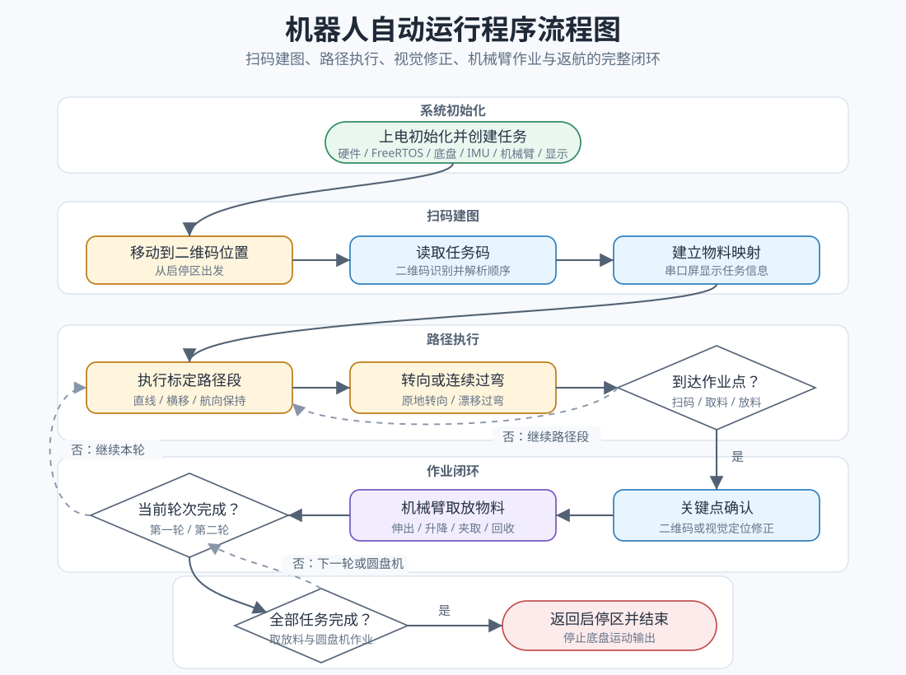

# 控制系统设计

## 1、控制系统设计思路

本机器人控制系统采用“底盘运动 + 机械臂作业 + 视觉感知”的分层设计思路，运行于 STM32F750V8 主控上的 FreeRTOS 实时操作系统。主流程负责任务顺序、路径切换和取放料衔接，各功能部分按照比赛流程分时工作，避免底盘运动、机械动作和感知处理相互干扰。

底盘部分负责机器人在场地中的平移、转向和连续过弯。运动控制采用开环速度轨迹与 IMU 航向约束相结合的方式，将实际路线拆分为直线移动、原地转向和漂移过弯等段落。直线段按照标定好的速度和持续时间运行，并通过 IMU 偏航角保持车头方向；拐角处根据空间条件选择停下原地转向或边走边转，使机器人在保证通过速度的同时减小扫掠范围和踩线风险。

机械臂部分负责物料的夹取、搬运和放置。关节电机调整俯仰角度，伸缩臂将夹爪送入目标区域，升降机构调整作业高度，末端夹爪完成夹紧与释放。各轴动作采用位置控制，并通过电机到位反馈顺序衔接，主控只有在上一动作完成后才进入下一动作，从而保证取放料过程稳定可靠。

视觉感知部分由 IMU、二维码模块和 MaixCam Pro 视觉平台共同提供信息。IMU 持续输出姿态角，用于底盘航向保持和转向判断；二维码模块读取比赛任务码，并解析物料顺序和仓位映射；MaixCam Pro 端沿用现有 OpenCV 视觉代码，通过 HSV 阈值、形态学处理、轮廓检测和直线检测识别色块、圆环、圆盘机及白线，并通过串口把目标坐标或线特征返回主控。

三部分通过主流程进行协同：长距离移动阶段优先执行底盘路径，机械臂保持安全姿态；到达取料、放料或识别节点后，底盘停止并保持车身稳定，主控向视觉端发送识别模式，获得坐标或状态确认后再执行机械臂动作；作业完成后继续进入下一段路径。系统整体采用“大段路径按标定执行、关键节点由感知修正”的策略，在保证运行速度的同时提高整套流程的可靠性。

## 2、主要器件选择

主控芯片选用 ST 意法半导体 STM32F750V8Tx。该芯片采用 Cortex-M7 内核，最高主频 216MHz，具备硬件浮点运算单元、DMA 控制器和多路 UART/USART 外设，能够满足多电机通信、姿态处理、实时任务调度和传感器数据接收的需求。系统运行 FreeRTOS 后，可将底盘控制、主任务流程、机械臂控制和传感器处理分配到不同任务中，使各模块既能独立运行，又能按照比赛流程进行协同。

底盘驱动采用四个 X42S 两相混合式步进电机驱动器，配合麦克纳姆轮构成全向移动平台。麦克纳姆轮底盘能够实现前进、后退、横移、斜行和原地旋转，适合在有限场地内完成多方向移动。四个电机通过同一串口总线与主控通信，主控将四轮速度命令打包后统一发送，并通过同步触发方式使四个电机同时响应，从而减少逐个发送命令造成的启动时差，提高横移和转弯时的轨迹一致性。

关节执行系统由无刷关节电机、伸缩升降步进电机和末端夹爪舵机构成。无刷关节电机负责机械臂俯仰运动，可通过绝对角度命令快速到达指定姿态；伸缩臂用于将夹爪送入料架、暂存区或圆盘机目标区域；升降机构用于调整夹取和放置高度；夹爪舵机用于完成物料夹紧和释放。伸缩与升降机构均采用位置指令控制，并通过电机返回的到位信号判断动作是否完成。为提高冷上电时的可靠性，机械臂通信接口在初始化和串口错误发生时会自动清除接收错误并重启接收，避免上电瞬间干扰导致回包丢失。

姿态传感器采用 IMU 模块，通过串口持续输出偏航角、俯仰角和横滚角。其中偏航角作为底盘航向保持和转向控制的主要反馈量，使机器人在开环位移过程中仍能维持稳定车头方向。二维码识别模块用于读取原料区任务码，主控根据任务码建立物料与仓位之间的对应关系。视觉模块用于识别圆盘机、物料色块和作业点位置，为关键节点提供坐标修正。串口屏用于显示任务码解析结果、当前运行状态和调试信息，方便现场调试和操作员确认。

## 3、程序流程图和说明

系统上电后，首先完成主控芯片的时钟、GPIO、DMA、串口和定时器等底层硬件初始化，随后启动 FreeRTOS 操作系统，并由启动任务完成各功能模块初始化。初始化内容包括底盘电机通信、IMU 姿态接收、机械臂电机通信、关节电机通信、二维码模块、视觉模块和串口屏显示等。机械臂通信接口在初始化阶段会清除可能存在的串口错误状态并重新启动 DMA 接收，保证冷上电后能够稳定接收电机返回数据。

初始化完成后，主任务进入比赛流程。机器人首先从启停区出发，移动到二维码识别位置，等待二维码模块返回任务码。主控解析任务码后建立物料顺序和目标仓位之间的映射关系，并将解析结果发送到串口屏显示。任务码确认后，机器人进入第一轮作业路径。

在路径执行阶段，主控按照预先标定的路径段依次控制底盘运动。普通直线段通过设定移动方向、速度和持续时间完成；需要转向的节点根据空间条件选择原地转向或连续过弯；需要快速通过的拐角采用移动速度与航向角同步变化的方式，使车辆在不停顿或少停顿的情况下完成方向切换。底盘运动过程中，IMU 持续提供偏航角反馈，用于修正车头姿态。

当机器人到达取料、放料或圆盘机作业区域时，主控先停止底盘运动，使机器人保持稳定，然后进入机械臂动作流程。机械臂根据当前任务目标完成伸出、下降、夹取、抬升、回收和放置等动作。每一步动作均等待对应机构到位后再执行下一步，避免因动作未完成而导致夹取失败或放置偏差。机械臂动作结束后，底盘继续执行下一段路径。

整个比赛流程按照“扫码建图、第一轮取放料、第二轮取放料、圆盘机作业、返回启停区”的顺序展开。若当前轮次任务未完成，系统继续在原料区、加工区、暂存区和圆盘机之间循环；若全部任务完成，机器人执行返回路径，回到启停区后停止所有运动输出，等待下一次启动或人工处理。
